# Best Week-Long Autumn Treks in the Pacific Northwest

## Executive summary

**Pacific Crest Trail Section J** — Snoqualmie Pass to Stevens Pass, Washington — is one of the strongest **September** week-long backpacks in the Pacific Northwest, but it is **not** the best single answer for the whole **September–November** window. Its core strengths are a near-ideal week-long length of about **75 miles**, roughly **16,000 feet of gain**, classic lakes-and-ridges scenery through the **Alpine Lakes Wilderness**, and relatively simple **free, self-issued wilderness permits** rather than hard quotas. Its main weakness is seasonality: both WTA and the Mountaineers effectively frame it as a **July–September** route, and the Mountaineers explicitly note that snow can fall here in September.

If your trip is **early to mid-September**, the more compelling “must-not-miss” upgrades are usually **Pacific Crest Trail Section K** — Stevens Pass to Rainy Pass — and **Wonderland Trail** in Mount Rainier National Park. Section K is longer, wilder, and more dramatic, with close-up views of **Glacier Peak** and long ridge/meadow walking; Wonderland is the strongest all-round scenic circuit in the region, with glaciated volcano scenery, subalpine meadows, and huge variety, but it is also steeper, busier, and more permit-constrained.

If your window extends into **October or November**, the decision changes. By then, most of the PNW’s truly elite alpine 6–9 day treks become increasingly condition-dependent or plainly wintery. For that later period, the best alternative is not another high-Cascade route but the **North Coast Route** in **Olympic National Park**, especially if you value photography, storm light, sea stacks, solitude, and lower snow risk over alpine ridgelines. It is less of an alpine classic than Section J, but it is a better **late-season** backpacking answer.

A direct answer to your original permit question is: for **Section J alone, no PCT long-distance permit is normally needed** because those long-distance permits are for **500+ continuous miles**; instead, Section J uses **free, self-issued local wilderness permits** for overnight use in Alpine Lakes, plus normal day-use parking fees/passes at the main trailheads.

## Scope, assumptions and decision framework

I assumed an **experienced, self-supported backpacker** camping in a tent, comfortable with roughly **10–15 miles per day with a full pack**, but **not** seeking technical snow travel, ice axe work, or true winter mountaineering. I also assumed that fitness, budget, solo-vs-group, and car-shuttle flexibility are still open variables. Those assumptions matter because the “best” route shifts sharply depending on whether you want the **best alpine scenery in stable September weather** or the **best odds of a safe, enjoyable backpack when dates slip into late October or November**.

My decision rule is therefore simple. For **September**, I prioritised routes with the best mix of **alpine lakes, ridgelines, fall colour, and week-long scale**. For **October–November**, I penalised high routes unless official sources and recent conditions suggested they remained broadly viable without winter skills. That framework strongly favours Section J in September, but it penalises it once autumn storms and first significant snows become likely.

A final reality check: throughout the Cascades, **September can also mean wildfire smoke**, which can materially degrade long-range scenery even when trails are otherwise snow-free. Recent reports on Section J and the Wonderland corridor both show that trade-off very clearly.

## Comparison table

*Note: for variable loops and extensions, I use the most commonly cited published figure or a clearly marked approximation; actual totals vary with trailhead choice, side trips, and permit-constrained camps.*

| Route                                                                                   |                          Length |                Days |                       Elevation gain | Best month in Sep–Nov | Permit needs                                                                                                                        | Parking                                                                                | Highlights                                                                                                             | Difficulty                     | Snow risk                                                                                                     |
| --------------------------------------------------------------------------------------- | ------------------------------: | ------------------: | -----------------------------------: | --------------------- | ----------------------------------------------------------------------------------------------------------------------------------- | -------------------------------------------------------------------------------------- | ---------------------------------------------------------------------------------------------------------------------- | ------------------------------ | ------------------------------------------------------------------------------------------------------------- |
| **Pacific Crest Trail Section J** — Snoqualmie Pass to Stevens Pass                     |                      74.7–75 mi |                 6–8 |                           ~16,000 ft | **September**         | Free self-issue wilderness permit for Alpine Lakes overnight use; no 500+ mile PCT permit needed for this section                   | Snoqualmie and Stevens trailheads are fee/pass sites ($5/day or accepted passes)       | Kendall Katwalk, Spectacle/Waptus country, Deception/Hope/Trap/Josephine zone, strong blueberry colour in early autumn | Hard                           | Moderate in early Sep; high by late Sep/Oct; very high in Nov                                                 |
| **Pacific Crest Trail Section K** — Stevens Pass to Rainy Pass                          |                      123–124 mi |                 7–9 |                           ~26,351 ft | **Early September**   | More complex: free self-issue in Forest wilderness areas, plus site-specific North Cascades backcountry permitting where applicable | Stevens Pass is a fee/pass trailhead; point-to-point logistics required                | Close Glacier Peak views, panoramic ridge walks, Lake Valhalla/Lake Janus, Dishpan Gap, White and Red Pass             | Very hard                      | Moderate in early Sep; high by late Sep/Oct; very high in Nov                                                 |
| **Wonderland Trail** — Mount Rainier National Park                                      |                          ~93 mi |                 7–9 |                           ~27,000 ft | **September**         | Site-specific wilderness permit required; $6 reservation fee + $12 per person per night; park entry fee also applies                | Park trailhead parking inside Mount Rainier NP; entrance pass required                 | Full circumnavigation of a glaciated volcano, huge subalpine variety, meadows, river valleys, big viewpoints           | Very hard                      | Moderate in early Sep; high in late Sep/Oct; very high in Nov                                                 |
| **Enchanted Valley and O'Neil Pass** — Graves Creek to Enchanted Valley and O'Neil Pass |    ~41 mi return to O’Neil Pass |                 6–7 | ~4,000–6,000 ft depending side trips | **Early October**     | Olympic wilderness permit required year-round; $8 pp/night + $6 per permit; park entry fee applies                                  | Access is via the Quinault/Graves Creek side; road status must be rechecked            | Rainforest, waterfalls, historic chalet, valley-floor elk/bear country, pass day trips                                 | Moderate/Hard                  | Lower than Cascade crest routes to Enchanted Valley itself; high on pass side trips after first autumn storms |
| **Timberline Trail** — Mount Hood Wilderness                                            |                   38–40 mi base | 5–6 with side trips |                      ~9,000–9,852 ft | **September**         | Free self-issued wilderness permit from 15 May–15 Oct where provided                                                                | Start-dependent; many trailheads use $5 day fee / recreation pass                      | Constant mountain presence, waterfalls, alpine meadows, canyon traverses                                               | Hard                           | Moderate in Sep; high in Oct; very high in Nov                                                                |
| **Three Sisters Loop** — Three Sisters Wilderness                                       |                    47.7–48.1 mi |                 5–7 |                      ~5,800–7,034 ft | **September**         | Central Cascades overnight permit 15 Jun–15 Oct; $6 per group; some starts also require day-use permit on quota trailheads          | Common east-side starts typically require recreation pass / $5 day fee                 | Volcanic basins, lakes, broad lava-and-pumice landscapes, golden grasses, easier grades than Washington big routes     | Moderate/Hard                  | Moderate in Sep; high in Oct; very high in Nov                                                                |
| **North Coast Route** — Olympic National Park                                           | 35 mi for Shi Shi→Ozette→Rialto |                 5–7 |     ~2,000 ft total, route-dependent | **October**           | Olympic wilderness permit required year-round; Makah pass needed for Shi Shi access; bear canister required                         | Shi Shi requires paid private overnight parking; Ozette/Rialto use park access/parking | Sea stacks, arches, beaches, tidal headlands, sunset/surf photography, autumn whale migration window                   | Moderate, but hazard-sensitive | Low snow risk; high rain, surf, tide and creek-crossing risk later in autumn                                  |
| **Eagle Cap Grand Loop** — Eagle Cap Wilderness                                         |                          ~53 mi |                 6–8 |                           ~13,251 ft | **Late September**    | Free self-issued wilderness permit at trailheads                                                                                    | Many trailheads are free/no fee                                                        | Big alpine lakes, granite, broad Wallowa panoramas, quieter than Rainier/Hood                                          | Hard                           | Moderate in Sep; high after early-Oct snow returns                                                            |

## Is Section J the best choice?

For a **pure week-long September backpack**, Section J is hard to criticise. It is almost perfectly sized for **6–8 days**, has strong scenery throughout rather than just in short showcase bursts, stays mostly on a well-defined trail, and avoids the quota-and-itinerary chess of the Wonderland Trail. The mix is especially attractive for backpackers who want a serious but not absurdly strenuous trip: long alpine stretches, many lakes, classic spots such as Kendall Katwalk and Spectacle Lake, and meaningful remoteness without full North Cascades logistical complexity. A recent September 2024 report also found the section snow-free, with beautiful lakes and less crowding than expected despite through-hiker traffic.

It is also comparatively simple to organise. Overnight use in Alpine Lakes is covered by a **free self-issue wilderness permit** at the trailhead, while the main trailheads at Snoqualmie and Stevens are straightforward road accesses with normal USFS day-use fees or accepted passes. Crucially, for this route alone you do **not** need the special PCT long-distance permit used for 500+ mile continuous trips. There is also **no meaningful on-route resupply**, so it works best as a single carry from one trailhead to the other.

The case against Section J is not about quality; it is about **timing**. Mountaineers lists its practical backpacking season as **July–September** and explicitly warns that snow can fall here in September. That makes Section J an excellent **September** proposition, but a shaky one for a broad “September–November” brief. If your actual departure date could slide into the second half of October or November, Section J stops being the best overall answer because so much of what makes it special is exposed, high-country walking around lakes and ridges.

### Visual reference galleries

These galleries use locally saved copies of public Wikimedia Commons images so the GitHub Pages version loads reliably. I grouped the images by trek, removed duplicates, and chose route-specific views that help answer the practical autumn question: what kind of scenery, exposure, vegetation, and weather mood should you expect in the best season for that route?

#### Pacific Crest Trail Section J

  <figure>
    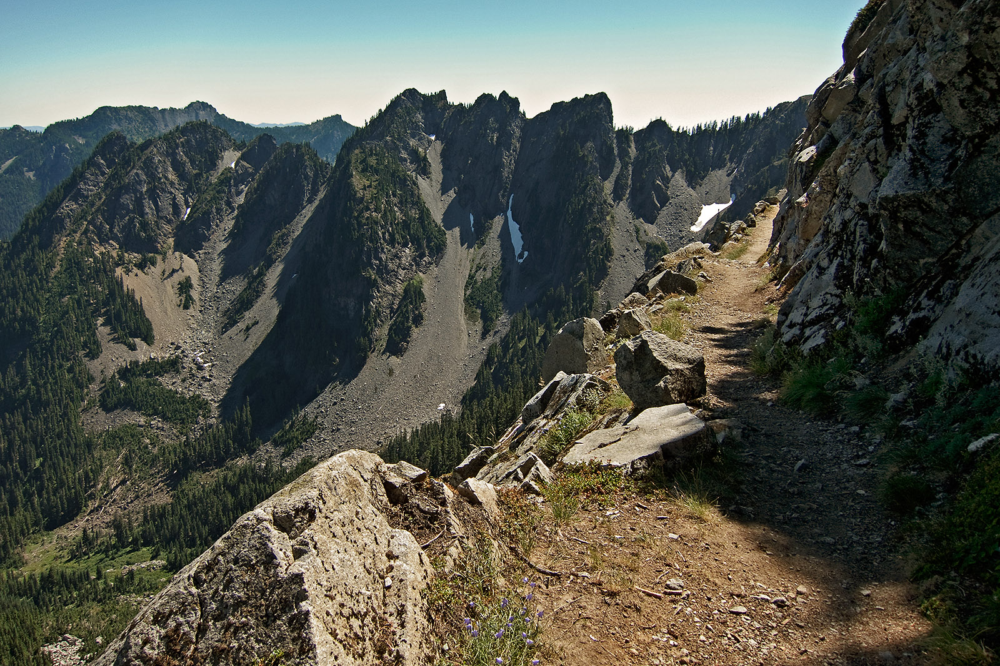
    <figcaption>Kendall Katwalk: the airy Alpine Lakes ridge walking that makes Section J compelling in September. Source: <a href="https://commons.wikimedia.org/wiki/File:Kendall_Katwalk_Trail.jpg">Wikimedia Commons</a>.</figcaption>
  </figure>
  <figure>
    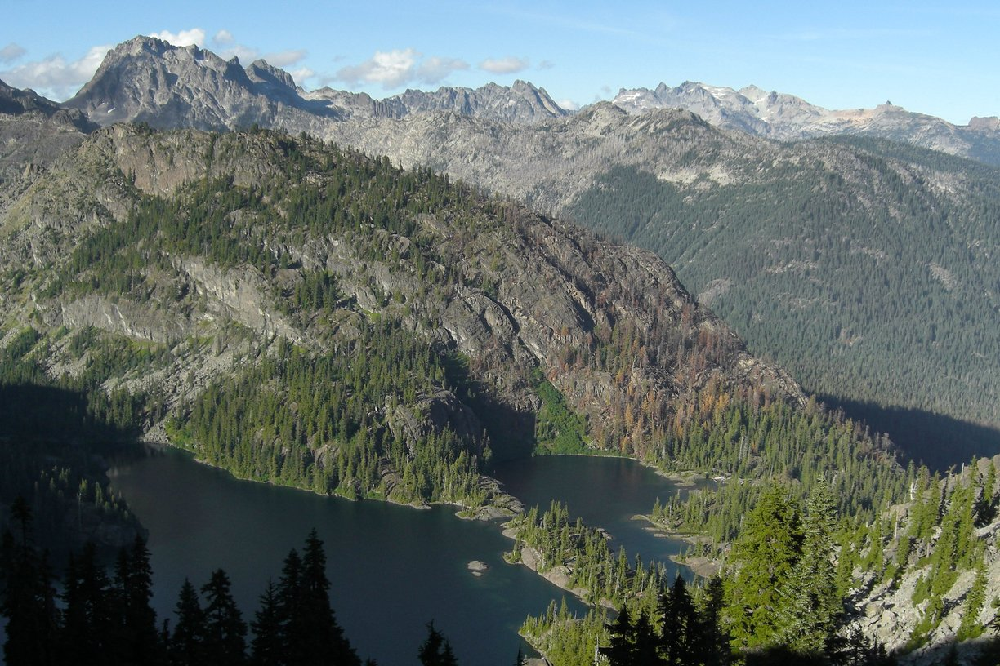
    <figcaption>Spectacle Lake country, photographed in late September, showing the lake-and-ridge character of the route. Source: <a href="https://commons.wikimedia.org/wiki/File:Spectacle_Lake_(5037700587).jpg">Wikimedia Commons</a>.</figcaption>
  </figure>
  <figure>
    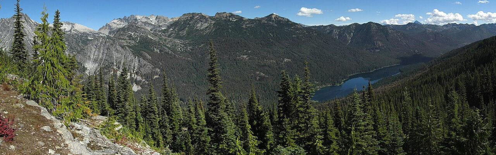
    <figcaption>Waptus Lake: a lower, broader counterpoint to the exposed ridges and high basins. Source: <a href="https://commons.wikimedia.org/wiki/File:Waptus_Lake_(5037716603).jpg">Wikimedia Commons</a>.</figcaption>
  </figure>

#### Pacific Crest Trail Section K

  <figure>
    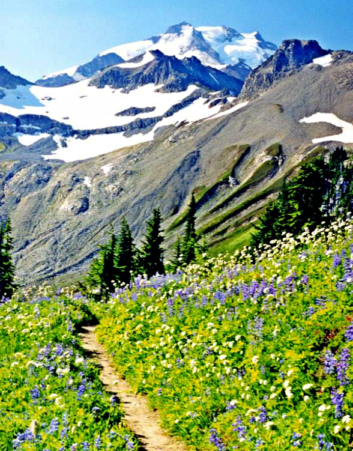
    <figcaption>Glacier Peak Wilderness terrain: Section K’s bigger, more remote escalation from Section J. Source: <a href="https://commons.wikimedia.org/wiki/File:Pacific_Crest_Trail_-_Glacier_Peak_Wilderness.jpeg">Wikimedia Commons</a>.</figcaption>
  </figure>
  <figure>
    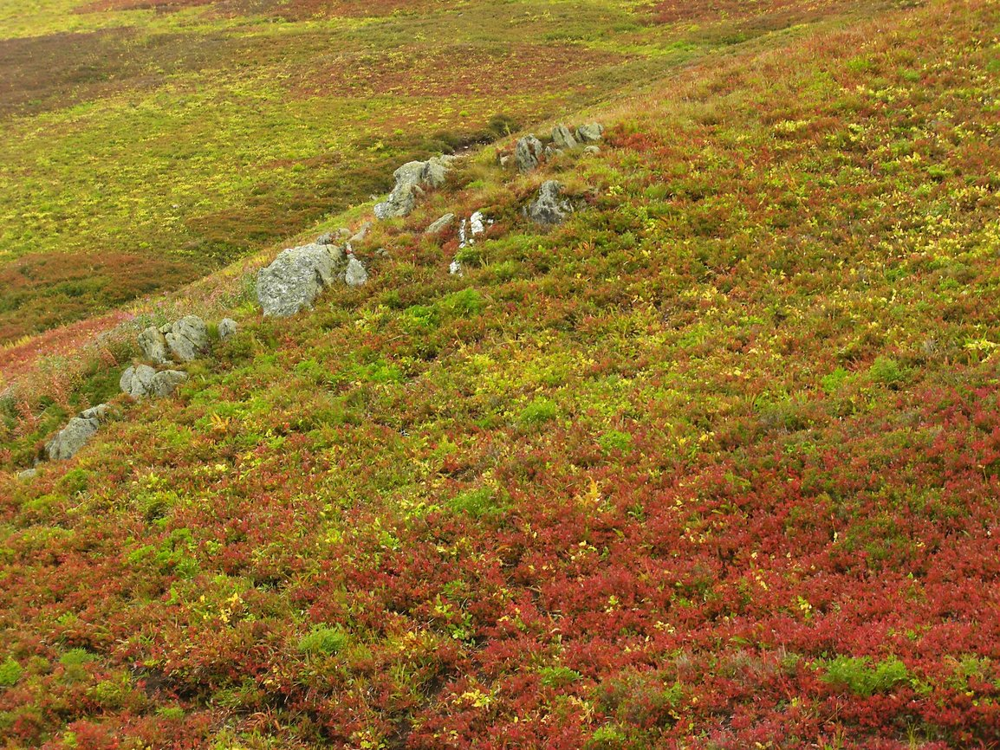
    <figcaption>Meadows near Red Pass, photographed in late September; useful for judging the early-autumn color window. Source: <a href="https://commons.wikimedia.org/wiki/File:Outcrop_in_Meadows_near_Red_Pass_(5038382388).jpg">Wikimedia Commons</a>.</figcaption>
  </figure>
  <figure>
    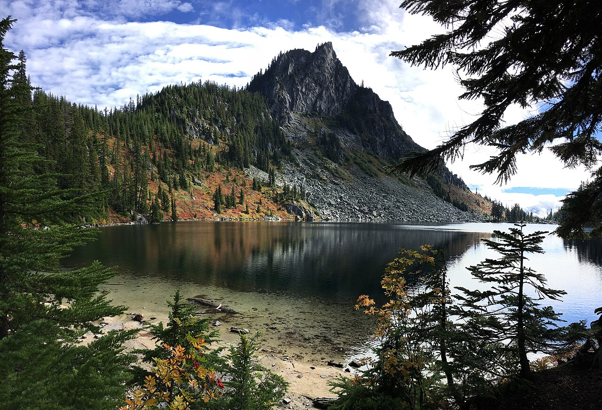
    <figcaption>Lake Valhalla near Stevens Pass: one of the more accessible Section K lake scenes. Source: <a href="https://commons.wikimedia.org/wiki/File:Lichtenberg_Mountain_from_Valhalla_Lake.jpg">Wikimedia Commons</a>.</figcaption>
  </figure>

#### Wonderland Trail

  <figure>
    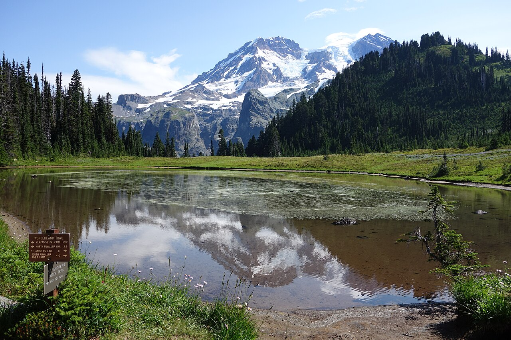
    <figcaption>Aurora Lake in Klapatche Park: west-side meadow and lake scenery with Rainier above. Source: <a href="https://commons.wikimedia.org/wiki/File:Aurora_Lake_is_a_popular_landmark_in_Klapatche_Park_along_the_Wonderland_Trail,_with_views_of_Mount_Rainier._(051e4fca-330d-4607-821a-c22908b92baf).JPG">Wikimedia Commons</a>.</figcaption>
  </figure>
  <figure>
    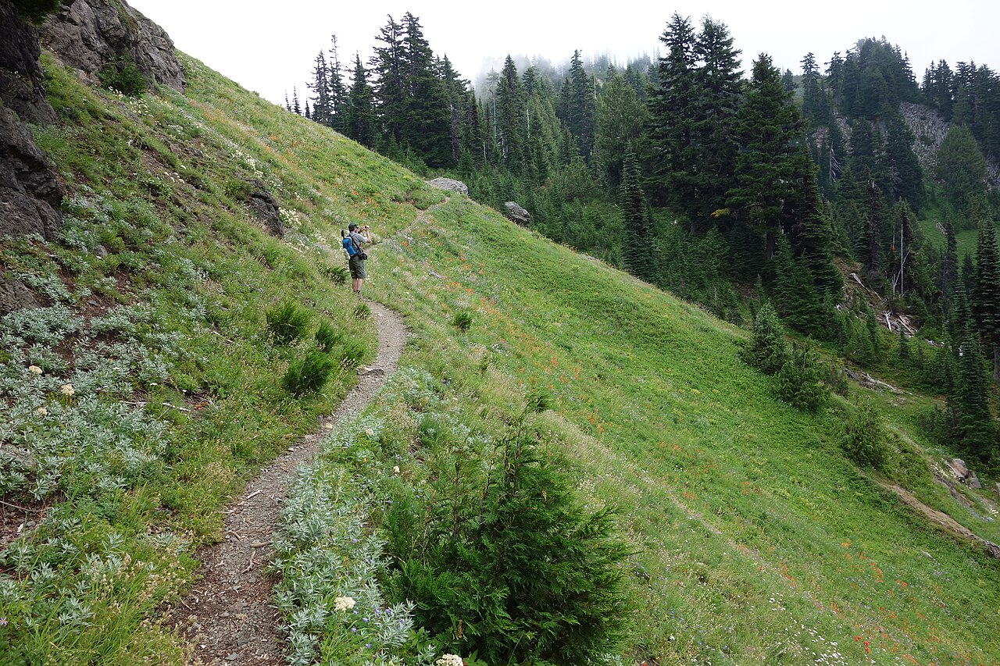
    <figcaption>Klapatche to St. Andrews Park: representative high-country tread from the September sweet spot. Source: <a href="https://commons.wikimedia.org/wiki/File:Wonderland_Trail_between_Klapatche_and_St._Andrews_Park_(c1f29c1a-256c-4124-b24f-248593ad8865).JPG">Wikimedia Commons</a>.</figcaption>
  </figure>
  <figure>
    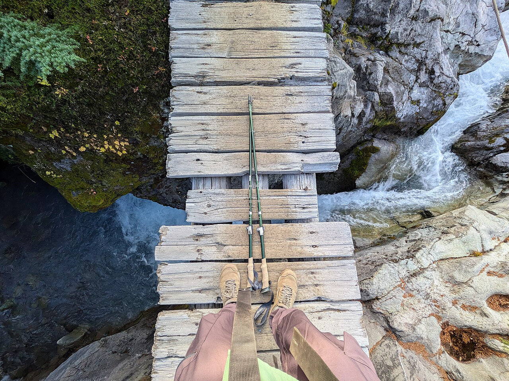
    <figcaption>Indian Bar on 13 October 2024: a useful late-season reality check for the south-east side. Source: <a href="https://commons.wikimedia.org/wiki/File:Bridge_across_the_Ohanapecosh_River_at_Indian_Bar_(13_October_2024)_4.jpg">Wikimedia Commons</a>.</figcaption>
  </figure>

#### Enchanted Valley and O'Neil Pass

  <figure>
    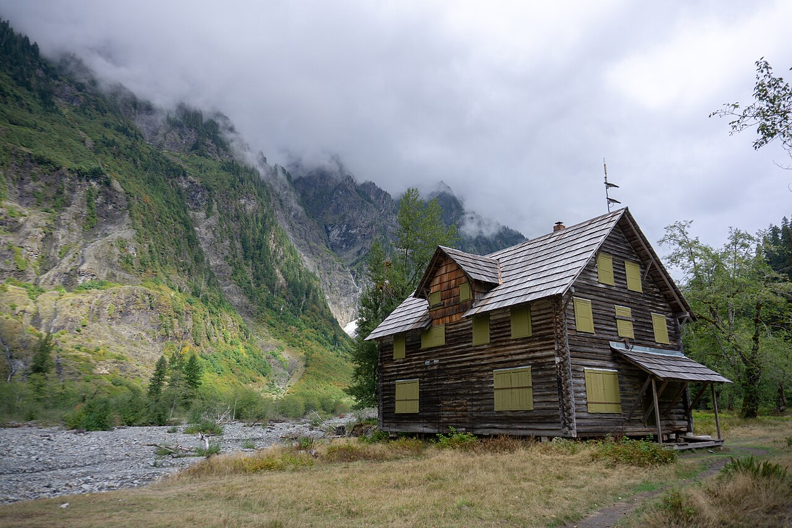
    <figcaption>The Enchanted Valley Chalet anchors the rainforest-valley character of the route. Source: <a href="https://commons.wikimedia.org/wiki/File:Enchanted_Valley_Chalet_2018.jpg">Wikimedia Commons</a>.</figcaption>
  </figure>
  <figure>
    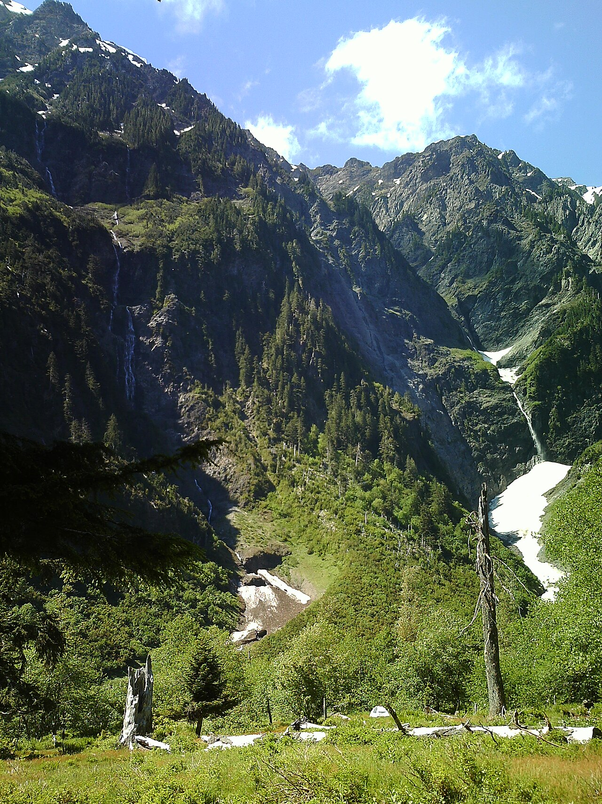
    <figcaption>East Fork Quinault corridor: lower, wetter, greener, and more October-tolerant than the Cascade crest. Source: <a href="https://commons.wikimedia.org/wiki/File:Enchanted_Valley,_East_Fork_Quinault_River.JPG">Wikimedia Commons</a>.</figcaption>
  </figure>
  <figure>
    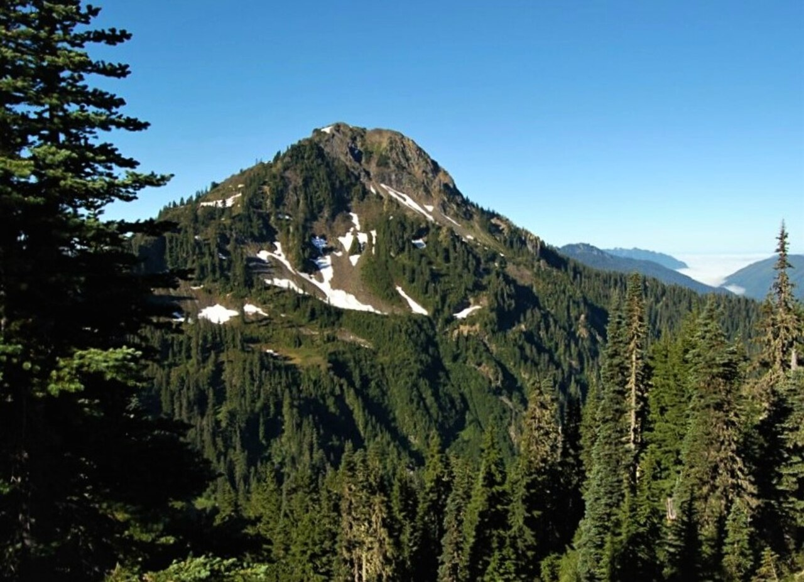
    <figcaption>O'Neil Pass area: the higher side-trip terrain where autumn snow risk rises first. Source: <a href="https://commons.wikimedia.org/wiki/File:O%27Neal_Pass_mtn.jpg">Wikimedia Commons</a>.</figcaption>
  </figure>

#### Timberline Trail

  <figure>
    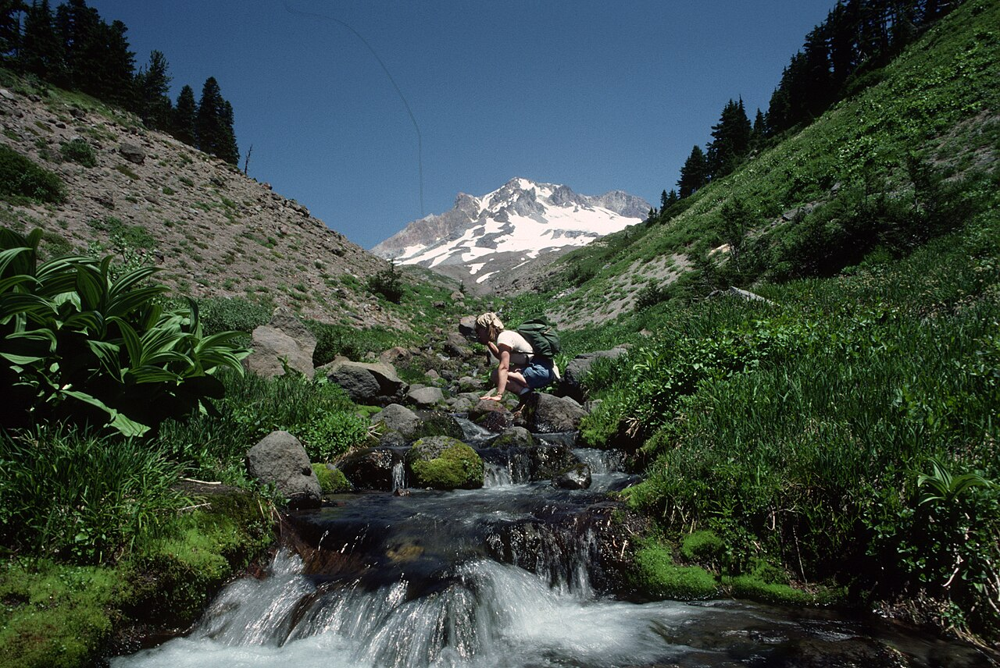
    <figcaption>Timberline/PCT tread on Mount Hood: compact, exposed, and volcano-forward. Source: <a href="https://commons.wikimedia.org/wiki/File:Hiking_Timberline_Trail,_Pacific_Crest_Trail,_Mt_Hood_National_Forest_(36169868832).jpg">Wikimedia Commons</a>.</figcaption>
  </figure>
  <figure>
    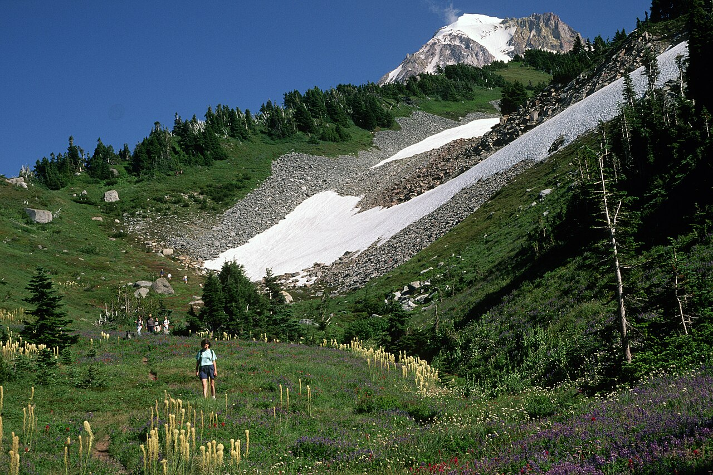
    <figcaption>Ladd Canyon: one of the canyon crossings that makes the loop feel bigger than its mileage. Source: <a href="https://commons.wikimedia.org/wiki/File:Recreation,_Hiking_Ladd_Canyon_Timberline_Trail,_Mt_Hood_National_Forest_(37000791776).jpg">Wikimedia Commons</a>.</figcaption>
  </figure>
  <figure>
    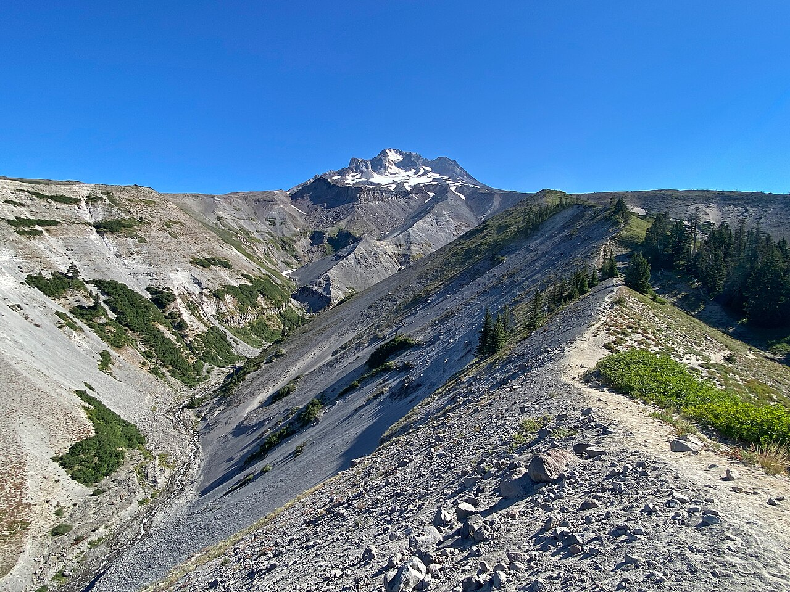
    <figcaption>Zigzag Canyon and Mount Hood: classic September Timberline Trail scenery. Source: <a href="https://commons.wikimedia.org/wiki/File:Zigzag_Canyon_at_Mt._Hood_in_OR_-_52320594376.jpg">Wikimedia Commons</a>.</figcaption>
  </figure>

#### Three Sisters Loop

  <figure>
    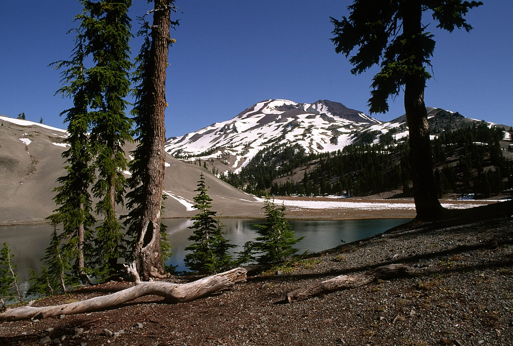
    <figcaption>Moraine Lake below South Sister: open volcanic basin scenery near the loop’s high-value core. Source: <a href="https://commons.wikimedia.org/wiki/File:Moraine_Lake_South_Sister,_Deschutes_National_Forest_(37092586445).jpg">Wikimedia Commons</a>.</figcaption>
  </figure>
  <figure>
    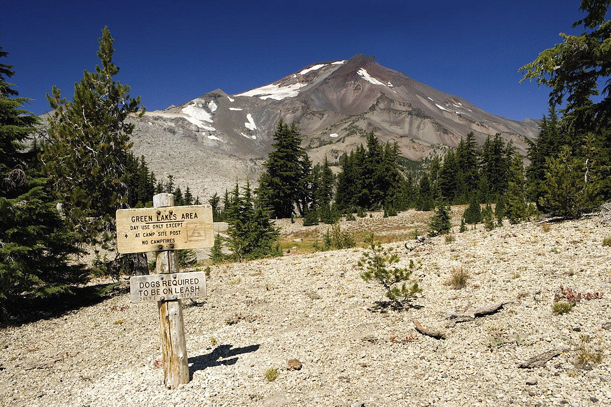
    <figcaption>Green Lakes side: golden grasses, pumice, and broad Central Oregon sightlines. Source: <a href="https://commons.wikimedia.org/wiki/File:South_Sister_from_Green_Lakes_Trail-Deschutes_(23305729683).jpg">Wikimedia Commons</a>.</figcaption>
  </figure>
  <figure>
    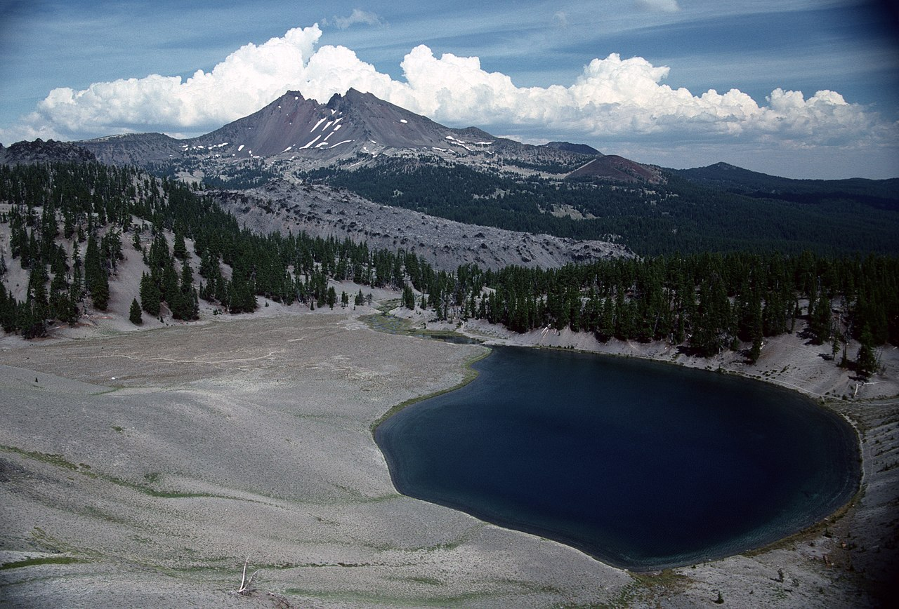
    <figcaption>Moraine Lake with Broken Top: shows the loop’s lava-and-lake contrast in clear-weather season. Source: <a href="https://commons.wikimedia.org/wiki/File:Moraine_Lake,_Broken_Top,_Deschutes_National_Forest_(35505548864).jpg">Wikimedia Commons</a>.</figcaption>
  </figure>

#### North Coast Route

  <figure>
    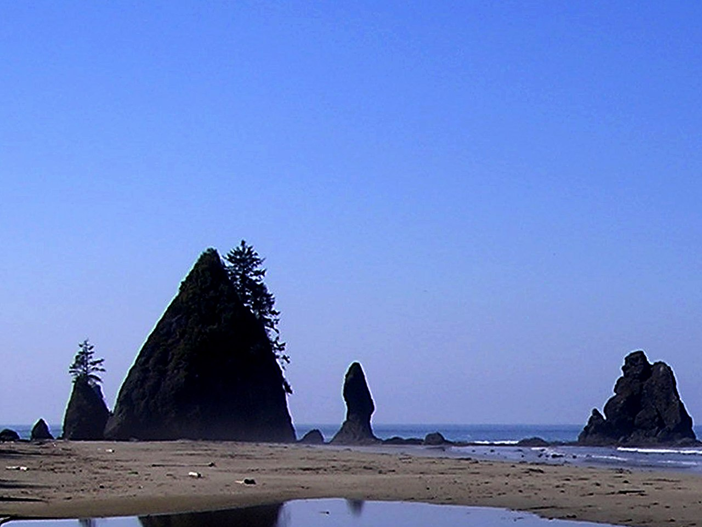
    <figcaption>Point of Arches at Shi Shi: the north-coast sea-stack drama that becomes more attractive in October. Source: <a href="https://commons.wikimedia.org/wiki/File:Shi_shi_Point_of_Arches32_(22790299769).jpg">Wikimedia Commons</a>.</figcaption>
  </figure>
  <figure>
    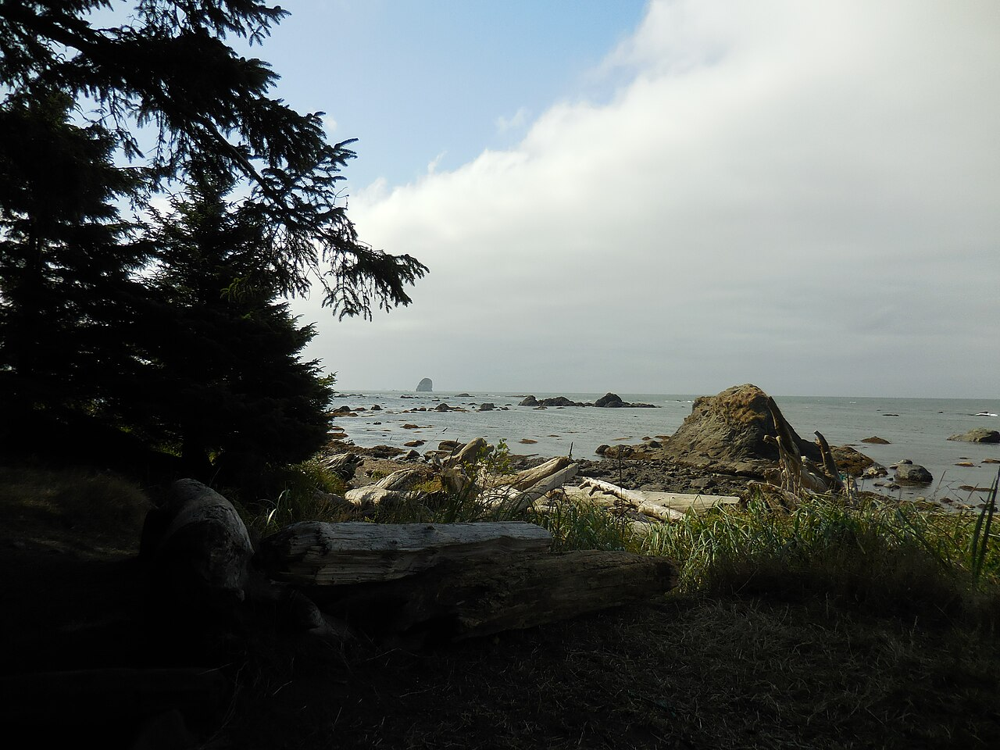
    <figcaption>Wilderness coast north of Ozette: beaches, headlands, and tidal-route texture rather than alpine tread. Source: <a href="https://commons.wikimedia.org/wiki/File:Wilderness_coast_north_ozette_triangle_beach_c_bubar_july_2014_(17313836965).jpg">Wikimedia Commons</a>.</figcaption>
  </figure>
  <figure>
    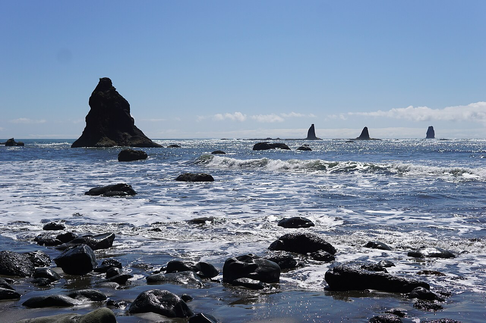
    <figcaption>Rialto Beach sea stacks: the late-season pivot from snow risk to tide, surf, and storm-light risk. Source: <a href="https://commons.wikimedia.org/wiki/File:Sea_stacks_off_Rialto_Beach_Olympic_National_Park.jpg">Wikimedia Commons</a>.</figcaption>
  </figure>

#### Eagle Cap Grand Loop

  <figure>
    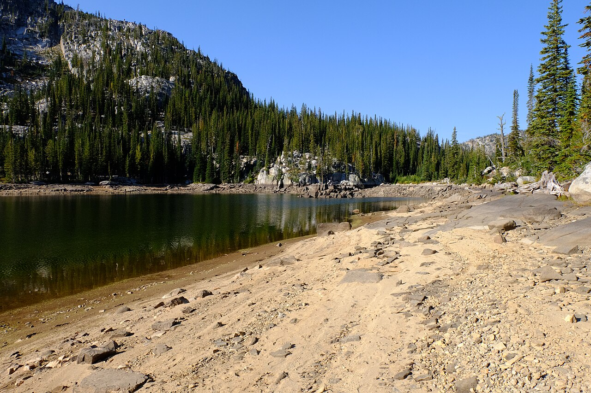
    <figcaption>Echo Lake: granite-and-lake terrain that differentiates Eagle Cap from the Cascades. Source: <a href="https://commons.wikimedia.org/wiki/File:Echo_Lake_(Eagle_Cap_Wilderness).jpg">Wikimedia Commons</a>.</figcaption>
  </figure>
  <figure>
    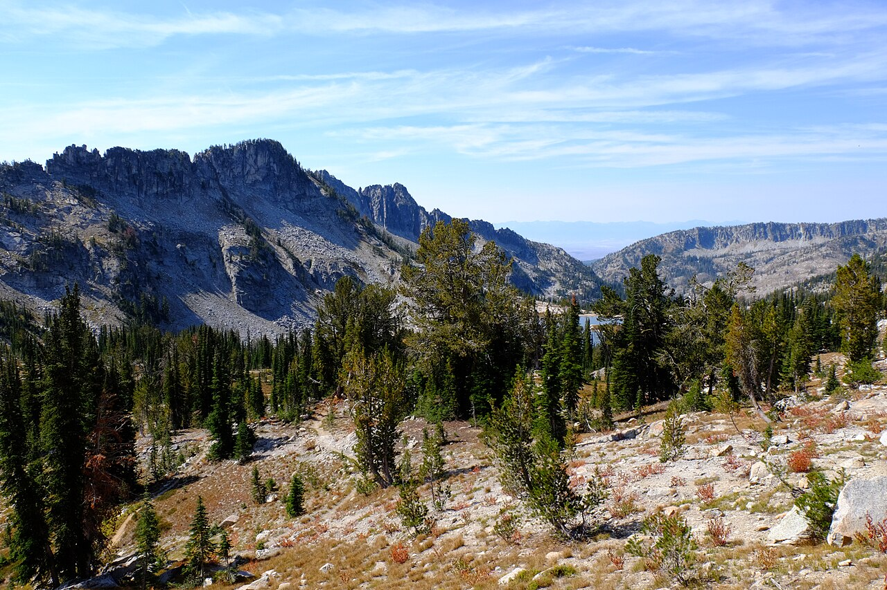
    <figcaption>Traverse Lake from the trail to Wonker Pass: a good read on the loop’s high-basin feel. Source: <a href="https://commons.wikimedia.org/wiki/File:Traverse_Lake_from_the_trail_to_Wonker_Pass.jpg">Wikimedia Commons</a>.</figcaption>
  </figure>
  <figure>
    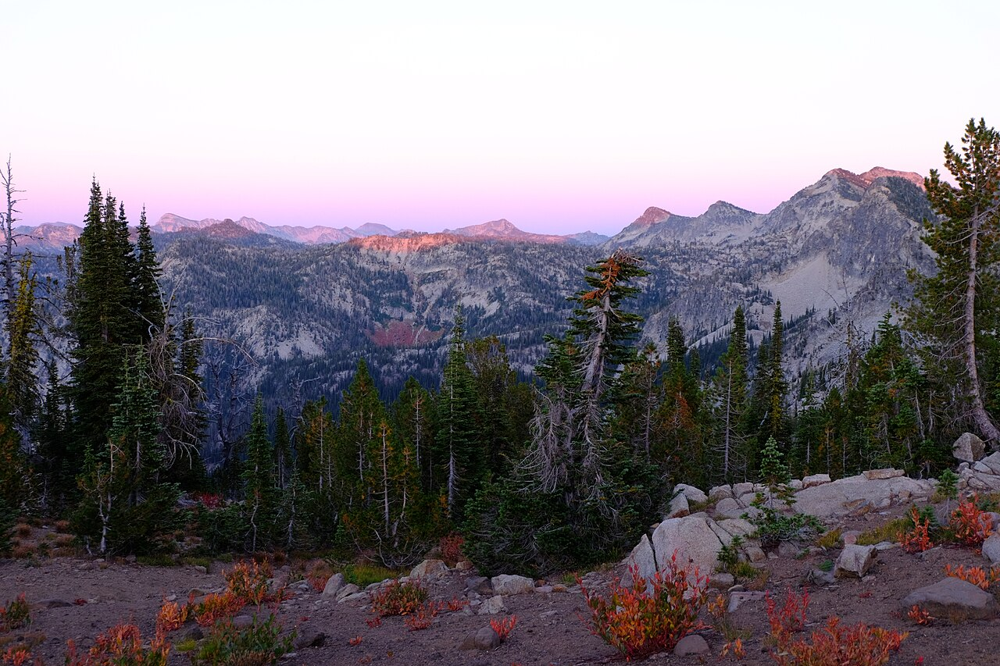
    <figcaption>Burger Pass at sunset: late-September light without the same maritime weather pattern as the west-side routes. Source: <a href="https://commons.wikimedia.org/wiki/File:Sunset_light_on_the_peaks_from_Burger_Pass.jpg">Wikimedia Commons</a>.</figcaption>
  </figure>

### Pacific Crest Trail Section K

If your trip can happen in **early September** and you are fit enough for a tougher, longer route, Section K is the clearest scenic upgrade over Section J. WTA lists it at roughly **123 miles and 26,351 feet of gain**, and the Mountaineers describe it as one of the PCT’s most spectacular stretches, highlighting flower meadows, close Glacier Peak views, and long panoramic ridge walks. Recent 2024–2025 reports show the route snow-free in late summer and early September, with some fall foliage, but they also flag brush, occasional bridge/stream issues, and real remoteness.

Why it can beat Section J: the scenery is bigger and wilder. You get high meadows, major passes, and repeated Glacier Peak drama rather than the somewhat more intimate lakes-and-ridges feel of Alpine Lakes. Why it may not beat Section J for you: it is longer, more physically demanding, and the permit matrix is less tidy because a full section hike intersects areas with different local permit rules, including North Cascades backcountry permitting.

A sensible **7-day southbound sketch** is below. Mileage will vary with camp availability and whether you use official sites only in regulated zones.

```mermaid
flowchart LR
A[Rainy Pass] --> B[North Fork Bridge Creek zone]
B --> C[Red Pass / White Pass]
C --> D[Dishpan Gap / Kodak Peak]
D --> E[Lake Sally Ann / Cady basin]
E --> F[Lake Janus / Lake Valhalla]
F --> G[Stevens Pass]
```

A practical **6–9 day itinerary** is: Day 1 Rainy Pass to Bridge Creek zone; Day 2 to Red/White Pass area; Day 3 to Dishpan Gap; Day 4 to Cady basin or Lake Sally Ann; Day 5 to Lake Janus; Day 6 to Lake Valhalla or lower camp; Day 7 out to Stevens Pass. Strong parties compress it; more relaxed parties often need eight or nine days. The best photography is usually around **Red Pass, White Pass, Dishpan Gap, Kodak Peak, Lake Janus, and Lake Valhalla**.

### Wonderland Trail

If your dates are in **September** and you can secure camps, Wonderland is the region’s most convincing **“must-not-miss”** backpack. Officially it is about **93 miles** with around **27,000 feet of gain and loss**, and it is usually mostly snow-free from **mid-July to October**. It is also the strongest single route for scenic variety: glacier views, volcanic flanks, deep river valleys, and long subalpine traverses. The trade-off is obvious: it is more strenuous than Section J, and its permit system is much more restrictive and costly.

The downside is not just paperwork. Wonderland is also prone to all the normal Cascade shoulder-season problems: early autumn storms, closure cascades around roads and facilities, and smoke in bad fire years. A September 2025 report on a Wonderland segment found excellent trails and relatively quiet travel, but badly degraded views from smoke. That is a fair summary of the route’s shoulder-season volatility: brilliant when clear, compromised when not.

A representative **8-day clockwise itinerary** from Longmire is below; actual camps depend entirely on permit availability.

```mermaid
flowchart LR
A[Longmire] --> B[South Puyallup]
B --> C[Golden Lakes]
C --> D[Mystic]
D --> E[Summerland / White River]
E --> F[Indian Bar]
F --> G[Nickel Creek]
G --> H[Pyramid Creek]
H --> I[Longmire]
```

For photographers, the highest-value stretches usually include the **west-side meadows, high alpine camps, and any clear-weather glacier viewpoints**; for decision-making, the key point is that Wonderland is usually the most spectacular *if* you can get the permits and still travel in stable September conditions. If you cannot, Section J becomes the more realistic and often more enjoyable choice.

### Olympic Wilderness Coast

For **late October into early November**, the North Coast route in Olympic is the smartest alternative. It is not an alpine answer; it is a **late-season answer**. Officially, the route gives you **15 miles from Shi Shi to Ozette** and **20 miles from Ozette to Rialto**, with NPS recommending roughly **2 days + 3–4 days** respectively. That total fits a slow, photography-friendly **5–7 day** journey exceptionally well. Snow is far less of a problem than on the Cascade crest, but tides, surf, and creek crossings become the real hazards.

Why it can beat Section J in late season is simple: it stays viable when the alpine week-long classics usually do not. The North Coast has sea stacks, arches, headland ladders, tidepools, and dramatic storm light. NPS specifically warns about tidal restrictions, the need to check NOAA tide predictions, the risk from rolling logs, and the requirement to ford the Ozette River at low tide; overnight use also requires a wilderness permit and bear canister, while Shi Shi access adds a Makah Recreation Pass and paid private overnight parking.

A conservative **6-day** version looks like this:

```mermaid
flowchart LR
A[Shi Shi access / private parking] --> B[Shi Shi Beach]
B --> C[Seafield Creek zone]
C --> D[Sand Point / Cape Alava]
D --> E[Chilean or Norwegian Memorial]
E --> F[Ellen Creek]
F --> G[Rialto Beach]
```

This route is the right answer if your dates are uncertain, your priority is **dramatic seascape photography**, or you want to avoid the elevated snow and road-risk profile of the Cascades. It is the wrong answer if what you truly want is **alpine lakes, ridges, and golden huckleberry slopes**. In other words: it is a superb late-season replacement, not a scenic twin of Section J.

## Permits, logistics, parking and source-linked planning notes

For **Section J**, the shortest direct answer is: **free wilderness permit, yes; PCT long-distance permit, no; trailhead parking fee/pass, yes**. Overnight travel in Alpine Lakes uses the free self-issue permit at the trailhead, while the long-distance PCT permit system applies to **500+ mile continuous trips**, not a 75-mile section like this one. Snoqualmie North and Stevens North trailheads both list **$5 day-use fees or accepted recreation passes**, and both provide straightforward paved access.

In logistical terms, Section J remains highly attractive because it is a **clean point-to-point** with **no meaningful on-route resupply** and comparatively little bureaucracy. The main headache is simply the car shuttle. By contrast, Section K is more dramatic but more logistically awkward and more permit-complex; Wonderland is a loop, which simplifies transport, but its site-specific permitting is more restrictive and more expensive; Olympic coast logistics are simple once you embrace a private car shuttle or two-vehicle plan, but tide timing becomes the controlling variable rather than alpine weather.

Two lower-48 truths apply across essentially all of these routes. First, **September** is often the sweet spot for alpine backpacks because snow is mostly gone but deep autumn storms have not yet settled in. Second, by **late October and November**, the Pacific Northwest’s best week-long **alpine** routes generally stop being straightforward backpacking propositions and become condition-dependent shoulder-season or winter-skill trips. That is the main reason my overall recommendation changes with date.

The most useful planning links from this research are:

* [PCTA local permit areas](https://www.pcta.org/discover-the-trail/permits/local-permits/)
* [USFS Snoqualmie North trailhead](https://www.fs.usda.gov/r06/okanogan-wenatchee/recreation/pacific-crest-tr-north-snoqualmie-pass-trailhead)
* [USFS Stevens North trailhead](https://www.fs.usda.gov/r06/mbs/recreation/pacific-crest-trail-stevens-north-trailhead)
* [WTA Section J guide](https://www.wta.org/go-hiking/hikes/pacific-crest-trail-section-j-snoqualmie-pass-to-stevens-pass-east)
* [Mountaineers Section J overview](https://www.mountaineers.org/activities/routes-places/pacific-crest-trail-routes/pacific-crest-trail-snoqualmie-pass-to-stevens-pass)
* [WTA Section K guide](https://www.wta.org/go-hiking/hikes/pacific-crest-trail-section-k-stevens-pass-east-to-rainy-pass)
* [Mountaineers Section K overview](https://www.mountaineers.org/activities/routes-places/pacific-crest-trail-routes/pacific-crest-trail-stevens-pass-to-rainy-pass)
* [NPS Wonderland Trail page](https://www.nps.gov/mora/planyourvisit/the-wonderland-trail.htm)
* [NPS Mount Rainier wilderness permits](https://www.nps.gov/mora/planyourvisit/wilderness-permit.htm)
* [NPS Olympic North Coast route](https://www.nps.gov/olym/planyourvisit/north-coast-route.htm)
* [NPS Shi Shi Beach page](https://www.nps.gov/olym/planyourvisit/shi-shi-beach-olympic-wilderness.htm)
* [Mt. Hood NF Timberline Trail page](https://www.fs.usda.gov/r06/mthood/recreation/trails/timberline-trail-600)
* [Deschutes NF Three Sisters Wilderness page](https://www.fs.usda.gov/r06/deschutes/recreation/three-sisters-wilderness-deschutes)
* [Wallowa-Whitman Eagle Cap Wilderness page](https://www.fs.usda.gov/r06/wallowa-whitman/recreation/eagle-cap-wilderness)

Open constraints and limitations remain: your **exact dates**, **fitness**, **solo vs group**, **tolerance for shuttles**, **comfort with exposed fords/tidal hazards**, **budget for park/per-night permit fees**, and **whether you want classic alpine scenery or are open to coast/rainforest substitutes**. I also did **not** verify specific current commercial shuttle providers or current Wonderland food-cache practice in this report, so those should be confirmed once your dates are fixed.
